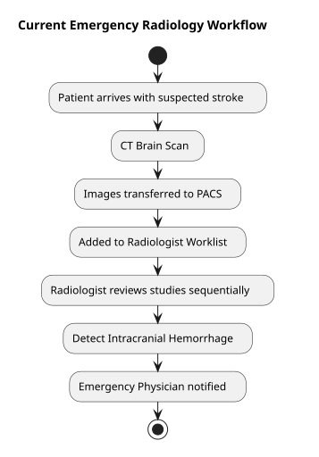
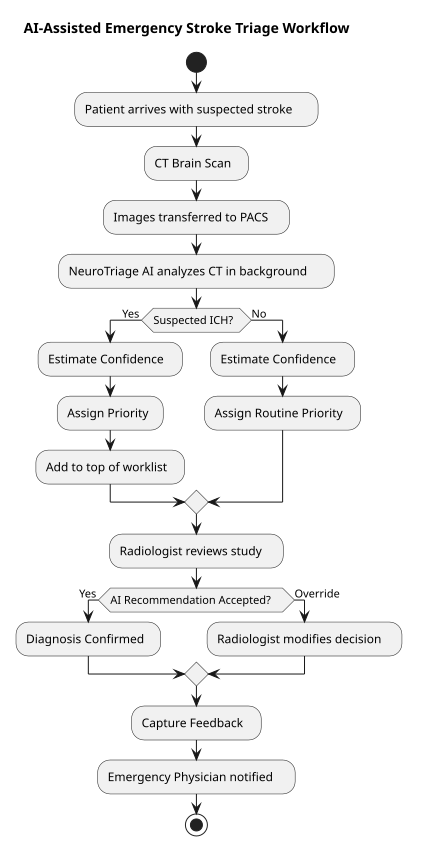
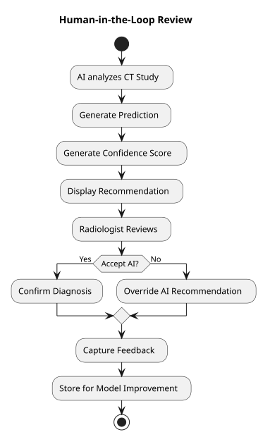

# NeuroTriage AI

## AI-assisted Emergency Stroke Triage Platform

### Final Report

**Course:** Management of AI Products  
**Program:** MBA in AI for Business  
**Submitted by:** Saksha Hegde

---

# Table of Contents

1. Product Strategy and Opportunity Framing
2. PM Artifact Pack
3. UX, Workflow, and Trust Design
4. Data, Model, and Evaluation Strategy
5. Business, Economics, and Scaling
6. Ethics, Governance, and Risk Note
7. References
8. Appendix

---

# 1. Product Strategy and Opportunity Framing

## Product Vision

NeuroTriage AI aims to reduce delays in identifying life-threatening intracranial hemorrhage (ICH) cases by intelligently prioritizing emergency CT brain studies within the radiologist's existing workflow. Rather than replacing clinical decision-making, the product assists radiologists in reviewing the most critical patients first, enabling faster diagnosis and improved patient outcomes.

---

## Product Positioning

NeuroTriage AI is an AI-assisted emergency radiology workflow platform designed to prioritize suspected intracranial hemorrhage cases within the existing PACS environment. Unlike standalone diagnostic AI tools, NeuroTriage AI focuses on improving clinical workflow by ensuring that the most urgent patients are reviewed first while keeping radiologists in complete control of diagnosis and treatment decisions.

---

## Jobs-To-Be-Done (JTBD)

> **When I am** reviewing a large number of emergency CT brain studies, 
**I want** the most critical patients to be automatically prioritized 
**so that** I can diagnose life-threatening intracranial hemorrhages earlier without compromising diagnostic accuracy.

### Primary User

Emergency Radiologist

### Supporting Stakeholders

- Emergency Physicians
- Hospital Administration
- Patients

---

## Opportunity Framing

### Why this problem matters

Intracranial hemorrhage is a time-critical medical emergency where early diagnosis directly influences patient survival and long-term neurological outcomes. In busy emergency departments, radiologists often review a large number of CT studies under significant time pressure. Since worklists are generally processed sequentially, critical hemorrhage cases may remain unnoticed until their turn arrives, delaying diagnosis and treatment.

Reducing the time taken to identify and review suspected ICH cases can improve patient outcomes, enhance emergency department efficiency, and reduce the cognitive burden on radiologists.

### Why current alternatives are weak

Current radiology workflows rely primarily on manual worklist management and clinician judgment to identify urgent cases. While experienced radiologists are highly skilled at detecting abnormalities, existing systems provide limited support in prioritizing studies before review.

Some standalone AI applications can detect abnormalities but require radiologists to access separate systems, interrupting their normal workflow. These solutions often function as diagnostic aids rather than workflow optimization tools and therefore provide limited operational benefit.

### Why AI may help

Artificial Intelligence can rapidly analyze CT brain images and estimate the probability of intracranial hemorrhage based on learned imaging patterns. Instead of replacing the radiologist, AI acts as an intelligent triage assistant by prioritizing high-risk studies immediately after image acquisition.

By integrating directly into the existing PACS workflow, AI enables radiologists to review the most urgent patients first while maintaining full clinical control. This Human-in-the-Loop approach combines the speed of AI with the expertise and accountability of clinicians.

---

## Opportunity Matrix

| Opportunity | Business Value | Feasibility | Priority |
|-------------|---------------|------------|----------|
| AI-assisted prioritization of suspected ICH cases | High | High | **P1** |
| AI-generated preliminary radiology report | High | Medium | P2 |
| Multi-condition detection (ICH, ischemic stroke, tumors) | Very High | Low | P3 |
| Emergency radiology analytics dashboard | Medium | High | P4 |

### Selected Opportunity

The first product release will focus exclusively on AI-assisted prioritization of suspected intracranial hemorrhage cases. This delivers immediate clinical value while keeping the MVP focused, feasible, and easy to validate.

---

## Build vs Buy vs Partner/API

### Recommended Path

**Build the workflow platform while integrating an existing AI model for the MVP.**

### Why

The primary value of NeuroTriage AI lies in seamlessly integrating AI into the radiologist's workflow rather than developing a novel image classification model. Leveraging an existing, clinically validated AI model (or a suitable open-source alternative for prototyping) enables faster product development while allowing the team to focus on workflow integration, user experience, and clinical adoption.

As the product matures, proprietary models can be developed or fine-tuned using larger, institution-specific datasets to improve performance and create long-term competitive differentiation.

### Main Trade-offs

| Approach | Advantages | Limitations |
|-----------|------------|-------------|
| Build | Full control, customization, long-term differentiation | Higher development effort and longer time-to-market |
| Buy | Faster implementation, clinically validated solutions may be available | Vendor dependency and limited customization |
| Partner/API | Rapid prototyping and lower upfront investment | Dependency on external providers and limited control over model evolution |

---

## First Wedge

The MVP will address a single, high-impact workflow:

> **Automatically prioritize suspected intracranial hemorrhage (ICH) CT studies within the radiologist's PACS worklist.**

The MVP will:

- Analyze non-contrast CT brain studies immediately after acquisition.
- Estimate the probability of intracranial hemorrhage.
- Assign a confidence score.
- Reorder the radiologist's worklist based on clinical urgency.
- Allow the radiologist to accept, reject, or override AI recommendations.

The MVP will **not** include:

- Automated diagnosis
- Treatment recommendations
- AI-generated radiology reports
- Detection of other neurological conditions
- MRI analysis

By focusing on a single workflow, the product minimizes implementation complexity while maximizing clinical impact and enabling rapid validation during pilot deployment.

---

## Product Principles

The following principles guide all product decisions for NeuroTriage AI and ensure that future enhancements remain aligned with the product vision.

### 1. Assist, Never Replace

AI supports radiologists by prioritizing cases and providing decision support. Final clinical responsibility always remains with the radiologist.

### 2. Prioritize, Don't Diagnose

The primary value of NeuroTriage AI is intelligent worklist prioritization. It is designed to ensure that the right patient is reviewed at the right time rather than to generate autonomous diagnoses.

### 3. Integrate, Don't Disrupt

The product integrates seamlessly into existing PACS workflows, requiring minimal changes to established clinical processes and reducing adoption barriers.

### 4. Trust Through Transparency

Every AI recommendation is accompanied by a confidence score and can be accepted, overridden, or rejected by the radiologist. Transparency is essential for clinician trust and responsible AI adoption.

### 5. Start Focused, Then Scale

The initial MVP addresses one high-impact use case—prioritization of suspected intracranial hemorrhage cases. Additional clinical workflows and AI capabilities will be introduced only after successful validation through pilot deployments.

---

# 2. PM Artifact Pack

## Problem Statement

Emergency radiologists in high-volume hospitals review a continuous stream of CT brain studies with varying levels of clinical urgency. Since worklists are typically processed sequentially, patients with acute intracranial hemorrhage (ICH) may wait behind less critical cases before receiving expert review. These delays can postpone diagnosis and treatment, negatively affecting patient outcomes while increasing cognitive workload on radiologists.

NeuroTriage AI addresses this workflow challenge by intelligently prioritizing suspected intracranial hemorrhage cases within the existing PACS worklist, enabling radiologists to review the most critical patients first while maintaining complete clinical control.

---

## Product Vision

To improve emergency stroke care by ensuring that life-threatening intracranial hemorrhage cases are reviewed at the earliest possible opportunity through AI-assisted workflow prioritization, while preserving radiologist autonomy, clinical accountability, and patient safety.

---

## PRD Summary

### User Problem

Radiologists currently lack an intelligent mechanism to identify the most clinically urgent CT brain studies before beginning image interpretation. As imaging volumes continue to increase, manual prioritization becomes increasingly difficult, resulting in delayed diagnosis of time-critical hemorrhage cases.

### Core Workflow

1. CT brain study is acquired.
2. Images are automatically transferred to PACS.
3. NeuroTriage AI analyzes the CT study in the background.
4. The AI predicts the probability of intracranial hemorrhage.
5. A confidence score is generated.
6. The PACS worklist is reordered based on predicted clinical urgency.
7. The radiologist reviews the prioritized studies.
8. The radiologist confirms, overrides, or rejects the AI recommendation.
9. User feedback is captured for future model improvement.

### AI Role

The AI functions as an intelligent clinical triage assistant. It predicts the likelihood of intracranial hemorrhage and recommends worklist prioritization. The AI never makes autonomous diagnoses or treatment decisions; all clinical decisions remain with the radiologist.

### Risks

- False negatives delaying review of critical hemorrhage cases.
- False positives increasing unnecessary urgent reviews.
- Automation bias causing excessive reliance on AI recommendations.
- Model performance degradation due to data drift.
- Integration challenges with existing PACS infrastructure.

### Fallback Logic

If the AI service becomes unavailable or the prediction confidence falls below a predefined threshold, the system automatically falls back to the standard PACS workflow. CT studies continue to be reviewed according to existing hospital procedures, ensuring uninterrupted patient care.

---

## Feature Prioritization

| Feature | User Value | Effort | Confidence | Priority |
|---------|-----------|--------|------------|----------|
| AI-assisted worklist prioritization | High | Medium | High | **P1** |
| Confidence score visualization | High | Low | High | **P1** |
| Radiologist override capability (Human-in-the-Loop) | High | Low | High | **P1** |
| Explainability visualizations (heatmaps / ROI highlights) | Medium | Medium | Medium | **P2** |
| Feedback-driven model improvement | High | High | Medium | **P2** |
| Workflow analytics dashboard | Medium | Medium | Medium | **P2** |
| Detection of additional hemorrhage subtypes | High | High | Low | **P3** |

---

## MVP Definition

The Minimum Viable Product (MVP) focuses on validating a single high-value workflow:

> **Automatically prioritize suspected intracranial hemorrhage CT studies within the radiologist's PACS worklist.**

The MVP will:

- Analyze non-contrast CT brain studies immediately after acquisition.
- Predict the probability of intracranial hemorrhage.
- Display a confidence score for every prediction.
- Reorder the radiologist's worklist based on predicted urgency.
- Allow radiologists to accept, reject, or override AI recommendations.
- Capture user feedback for future model improvement.

The MVP intentionally excludes:

- Automated diagnosis
- Treatment recommendations
- AI-generated radiology reports
- MRI analysis
- Detection of other neurological conditions

Restricting the MVP to a single workflow minimizes implementation complexity while enabling rapid validation of clinical usefulness, workflow integration, and user acceptance.

---

## Product Evolution Roadmap

### Phase 1 – MVP Validation

Validate the core product hypothesis by demonstrating that AI-assisted worklist prioritization reduces review delays without disrupting existing clinical workflows.

Deliverables:

- AI-assisted prioritization of suspected ICH studies
- Confidence score visualization
- Human-in-the-Loop review
- PACS worklist integration
- Basic system monitoring

---

### Phase 2 – Clinical Expansion

Expand product capabilities to improve clinician trust, usability, and operational effectiveness following successful MVP validation.

Deliverables:

- Explainability visualizations (heatmaps and highlighted regions of interest)
- Feedback-driven model improvement using radiologist validations
- Pilot deployment across multiple departments within the hospital
- Workflow analytics dashboard for operational and adoption metrics

---

### Phase 3 – Enterprise Scale

Transform NeuroTriage AI into an enterprise healthcare platform capable of supporting multiple hospitals while ensuring responsible AI governance.

Deliverables:

- Detection of additional intracranial hemorrhage subtypes (subdural, epidural, intraparenchymal, etc.)
- Multi-hospital deployment
- Continuous model performance monitoring and drift detection
- AI governance framework including audit trails, model versioning, and periodic validation

---

## Success Metrics

### Product Metrics

- Reduction in average Time-to-Review for suspected ICH studies.
- Percentage of high-risk CT studies correctly prioritized.
- Radiologist adoption rate.
- Average radiologist override rate.

### Business Metrics

- Reduction in emergency diagnosis turnaround time.
- Reduction in door-to-treatment time for hemorrhage patients.
- Improvement in emergency department workflow efficiency.
- Improved utilization of existing radiology resources.

### Trust / Guardrail Metrics

- **False Negative Rate:** Percentage of actual hemorrhage cases incorrectly classified as low risk. This is the most critical patient safety metric because missed hemorrhages can delay life-saving treatment.

- **False Positive Rate:** Percentage of normal CT studies incorrectly prioritized as urgent, increasing unnecessary workload for radiologists.

- **AI Confidence Calibration:** Measures whether the AI's confidence score accurately reflects the probability of being correct. Well-calibrated confidence enables clinicians to develop appropriate trust in AI recommendations without becoming over-dependent.

- **Radiologist Override Rate:** Percentage of AI recommendations modified or rejected by radiologists. A consistently high override rate may indicate reduced model performance, poor explainability, or lack of user trust.

- **System Availability During Emergency Operations:** Percentage of time the AI platform remains operational during emergency workflows. If the AI service becomes unavailable, the system must automatically revert to the standard PACS workflow, ensuring uninterrupted patient care.

---

# 3. UX, Workflow, and Trust Design

## Main Workflow

NeuroTriage AI is designed to integrate seamlessly into the existing radiology workflow without requiring users to learn a new application. The AI operates silently in the background immediately after a CT brain study is acquired and assists radiologists by intelligently prioritizing suspected intracranial hemorrhage (ICH) cases within the existing PACS worklist.

The user journey is as follows:

1. The patient undergoes a non-contrast CT brain scan.
2. CT images are automatically transferred to the hospital PACS.
3. NeuroTriage AI analyzes the study in the background without requiring any user interaction.
4. The AI analyzes the CT study and estimates both the likelihood of intracranial hemorrhage (ICH) and the confidence of its prediction.
5. The PACS worklist is reprioritized using the AI assessment and confidence score according to the predefined prioritization policy.
6. The radiologist reviews studies in priority order.
7. When a study is opened, NeuroTriage AI displays its assessment, confidence level, and supporting visual explanation.
8. The radiologist confirms, overrides, or rejects the AI recommendation.
9. Radiologist feedback is captured to support future model improvement.

This workflow improves emergency case prioritization while preserving the existing clinical workflow and ensuring that the radiologist remains responsible for all diagnostic decisions.

---

### Current Workflow

Figure 1 illustrates the existing emergency radiology workflow, where CT studies are typically reviewed sequentially without AI-assisted prioritization.

*Figure 1. Current emergency radiology workflow.*

---

### Proposed AI-Assisted Workflow

Figure 2 illustrates how NeuroTriage AI integrates into the existing workflow by automatically prioritizing suspected intracranial hemorrhage cases while preserving clinician oversight.

*Figure 2. AI-assisted emergency radiology workflow.*

---

## Wireframes / Screens

The MVP consists of two primary interfaces integrated directly into the existing PACS environment.

### Screen 1 – Prioritized PACS Worklist

Instead of requiring radiologists to interpret raw AI outputs, NeuroTriage AI translates model predictions into clinically meaningful worklist priorities.

### Prioritization Policy

| AI Assessment | Confidence | Priority | Rationale |
|---------------|------------|----------|-----------|
| Suspected ICH | High | 🔴 **Critical** | Strong evidence of a life-threatening condition requiring immediate review. |
| Suspected ICH | Medium | 🟠 **High** | Possible hemorrhage; early review is recommended due to potential clinical risk. |
| No Suspicious Findings | Medium | 🟡 **Moderate** | AI is uncertain. Earlier review helps reduce the chance of a missed hemorrhage. |
| No Suspicious Findings | High | 🟢 **Routine** | AI is confident that no urgent abnormality is present, allowing routine review. |

The prioritization policy combines the AI assessment with the model's confidence rather than relying on prediction alone. The objective is to minimize clinical risk rather than simply rank positive predictions first. Model uncertainty is treated as an indicator for earlier human verification, ensuring that potentially missed hemorrhage cases receive appropriate attention while minimizing unnecessary interruptions for confidently normal studies.

---

### Screen 2 – AI Decision Support Panel

When a radiologist opens a study, NeuroTriage AI presents only the information required to support clinical decision-making while minimizing cognitive load.

The panel displays:

- AI assessment
- Confidence level
- Highlighted region of interest (heatmap)
- Relevant CT slices
- Radiologist actions:
  - Confirm
  - Override
  - Reject

The final diagnosis always remains the responsibility of the radiologist.

---

## Trust and Explainability

NeuroTriage AI is designed to build clinician trust through transparency while avoiding unnecessary interface complexity. Trust is established by communicating the AI assessment, its confidence level, and the visual evidence supporting the recommendation while ensuring that the radiologist retains full clinical authority.

### What does the user need to know?

The radiologist should understand:

- The AI assessment.
- The confidence associated with the prediction.
- Why the AI highlighted the study.
- Which CT image regions contributed to the recommendation.

---

### What must be visible?

The interface displays:

- AI assessment
- Confidence level
- Priority indicator
- Highlighted region of interest
- Relevant CT slices
- Human override options

---

### What should be hidden?

To reduce cognitive overload, the interface intentionally hides:

- Neural network architecture
- Internal model computations and intermediate probabilities
- Training data statistics
- Intermediate feature representations
- Technical implementation details

The objective is to present clinically meaningful information rather than exposing unnecessary AI complexity.

---

## Uncertainty Handling

Since AI predictions are probabilistic, NeuroTriage AI explicitly communicates uncertainty and incorporates it into workflow prioritization.

### High Confidence

High-confidence predictions indicate that the AI has strong confidence in its assessment, enabling more reliable prioritization while still requiring radiologist confirmation.

- High-confidence suspected ICH studies receive the highest priority.
- High-confidence normal studies remain in the routine worklist.

---

### Medium Confidence

Medium-confidence predictions indicate uncertainty. Confidence is treated as a measure of uncertainty rather than correctness.

Instead of hiding this uncertainty, NeuroTriage AI increases review priority to encourage earlier clinical verification. This reduces the likelihood of missing clinically important hemorrhage cases while maintaining radiologist oversight.

---

### Failure or Fallback Behavior

Patient care must never depend solely on AI.

If the AI service becomes unavailable or fails to generate a reliable prediction:

- The standard PACS workflow continues without interruption.
- No AI prioritization is performed.
- No AI recommendation is displayed.
- Radiologists continue following existing hospital procedures.

This fail-safe design ensures uninterrupted emergency care even during AI system failures. AI failure must never result in interruption of clinical services.
The AI module is designed as a decision-support system rather than a mandatory workflow dependency.

---

## Human-in-the-Loop

The following workflow illustrates how NeuroTriage AI incorporates mandatory human review before any clinical decision is made.

*Figure 3. Human-in-the-Loop decision workflow.*

NeuroTriage AI follows a Human-in-the-Loop design philosophy where AI assists but never replaces clinical decision-making.

Human review is mandatory after AI prioritization and before any clinical diagnosis or treatment decision.

The radiologist may:

- Accept the AI recommendation.
- Override the AI prioritization.
- Reject the AI assessment completely.

Every override or rejection is captured as feedback for future model improvement.

NeuroTriage AI assists in prioritization, but every diagnosis remains the responsibility of the radiologist. This Human-in-the-Loop approach balances AI efficiency with clinical expertise, ensuring patient safety while enabling continuous learning from clinician feedback.

---

# 4. Data, Model, and Evaluation Strategy

## Problem as AI Task

The primary objective of NeuroTriage AI is not simply to detect intracranial hemorrhage (ICH), but to help radiologists identify emergency cases earlier within their existing workflow. The business problem is therefore to reduce delays in reviewing critical CT brain studies while maintaining diagnostic safety.

As the AI Product Manager, the first decision is to translate this business objective into an AI problem that can realistically be solved using available data.

The product requires two complementary AI tasks:

| Business Objective | AI Task | Why this AI Task? |
|--------------------|---------|-------------------|
| Detect suspected intracranial hemorrhage | Image Classification | CT scans are medical images where the objective is to classify whether signs of hemorrhage are present. |
| Prioritize studies within the worklist | Confidence-driven Prioritization | Confidence enables the product to distinguish between routine cases and studies that require earlier human review due to either suspected hemorrhage or prediction uncertainty. |

Separating image classification from workflow prioritization is an intentional product decision. The AI model predicts clinical findings, while the product decides how those predictions influence the radiologist's workflow. This ensures that clinical workflow remains under product governance rather than being dictated directly by the model.

---

## Data Sources

The effectiveness of NeuroTriage AI depends on the quality of data available throughout the product lifecycle. Data is therefore treated as a strategic product asset rather than simply a technical requirement.

Three complementary data sources have been identified.

| Data Source | Examples | Product Rationale |
|-------------|----------|-------------------|
| Historical Clinical Data | CT brain scans, radiologist reports, PACS metadata | Provides clinically relevant examples representing the hospital's workflow. |
| Anonymized Medical Imaging Datasets | Curated CT brain dataset containing hemorrhage-positive and normal studies used for prototype development | Provides representative training and evaluation data while protecting patient privacy. |
| Product Feedback Data | Radiologist confirmations, overrides, rejected recommendations | Enables continuous product improvement after deployment by learning from real clinical usage. |

Since NeuroTriage AI operates in a clinical environment, all datasets used for model development will be anonymized to remove patient-identifiable information. Only the minimum data required for model training and evaluation will be retained, following data minimization principles and supporting compliance with applicable healthcare privacy regulations.

---

## Labeling and Ground Truth

The quality of an AI product is directly influenced by the quality of its ground truth.

For NeuroTriage AI, the ground truth will be established using the final diagnosis documented by expert radiologists. Where differences of opinion exist, consensus review will be used to establish the final clinical label.

The model will classify studies into:

- Suspected Intracranial Hemorrhage
- No Suspicious Findings

An important product principle is that AI predictions never become ground truth. Instead, clinician-validated diagnoses remain the authoritative source for both model evaluation and future retraining. This ensures that the AI continuously learns from clinical expertise rather than reinforcing its own mistakes.

---

## Baseline

Before introducing AI, hospitals already possess an effective clinical workflow in which CT brain studies are reviewed sequentially through PACS.

This existing workflow serves as the baseline against which NeuroTriage AI will be evaluated.

Current workflow characteristics include:

- Sequential review of CT studies.
- No automated prioritization of emergency cases.
- Diagnosis depends entirely on manual worklist navigation.
- Critical cases may wait behind routine examinations during busy periods.

The objective of NeuroTriage AI is not to replace this workflow but to enhance it by ensuring that suspected emergency cases reach radiologists earlier without disrupting existing clinical practices.

---

## Model and API Choice

Since the product must analyse CT brain images, an image classification model is the most appropriate AI approach.

A CNN-based image classification model has been selected because Convolutional Neural Networks have consistently demonstrated strong performance in recognising clinically significant patterns within medical images while supporting rapid inference required for emergency care.

The trained model will be exposed through REST APIs, allowing seamless integration with existing PACS infrastructure. This avoids introducing new software for radiologists and supports one of the key product goals: **integrate into the workflow rather than replace it.**

The API provides:

- AI assessment (Suspected ICH / No Suspicious Findings)
- Confidence level
- Priority level
- Explainability information, including highlighted regions of interest

This modular design also allows future model upgrades without affecting the user experience or hospital workflow.

---

## Evaluation Framework

A successful AI product is not measured solely by model accuracy. It must also improve clinical workflow, gain user trust, and deliver measurable business value.

Accordingly, NeuroTriage AI will be evaluated using a balanced set of technical, operational, business, and trust-related metrics.

| Category | Metric | Why it Matters |
|----------|---------|----------------|
| Technical | Sensitivity | Maximise detection of hemorrhage cases. |
| Technical | Specificity | Reduce unnecessary prioritisation of normal studies. |
| Technical | False Negative Rate | Minimise the risk of missing critical patients. |
| Operational | Average Inference Time | Maintain responsiveness within emergency workflows. |
| Business | Time-to-Review Reduction | Demonstrate faster identification of emergency patients. |
| Business | Radiologist Adoption Rate | Measure acceptance of the product in routine practice. |
| Trust | Radiologist Override Rate | Evaluate confidence in AI recommendations. |
| Trust | Confidence Calibration | Ensure confidence scores accurately reflect prediction reliability. |
| Operational | AI System Availability | Ensure uninterrupted clinical support. |

This evaluation framework aligns technical performance with clinical impact, recognising that an accurate model alone does not guarantee a successful AI product.

---

## Launch Thresholds

Before deployment, clear success criteria must be established. Defining these thresholds in advance enables objective go/no-go decisions and prevents subjective evaluation after development.

NeuroTriage AI will progress from pilot deployment to wider clinical adoption only after consistently meeting the following criteria.

| Metric | Target | Product Rationale |
|---------|--------|-------------------|
| Sensitivity | ≥95% | Missing hemorrhage cases has unacceptable clinical consequences. |
| False Negative Rate | ≤2% | Patient safety remains the highest priority. |
| Average Inference Time | ≤10 seconds | Supports emergency department workflow without delays. |
| Radiologist Adoption Rate | ≥85% | Demonstrates that clinicians trust and routinely use the product. |
| AI System Availability | ≥99.5% | Ensures uninterrupted support during emergency operations. |

These thresholds represent not only technical expectations but also the minimum level of product performance required to deliver meaningful clinical value.

---

# 5. Business, Economics, and Scaling

## Monetization Model

NeuroTriage AI is designed as an enterprise software solution that integrates seamlessly into the hospital's existing PACS workflow. The product is licensed to hospitals as an optional AI-enabled stroke triage module, allowing healthcare providers to enhance their existing imaging infrastructure without replacing their current systems.

Hospitals choosing to enable this capability pay an annual enterprise license fee, which includes software updates, model improvements, technical support, and performance monitoring. This licensing approach provides a predictable revenue stream for the product provider while allowing hospitals to adopt AI capabilities with minimal disruption to their existing workflow.

---

## Value Logic

NeuroTriage AI creates value by improving emergency workflow efficiency rather than replacing radiologists.

| Stakeholder | Value Created |
|-------------|---------------|
| Patients | Earlier identification of suspected intracranial hemorrhage, enabling faster diagnosis and treatment. |
| Radiologists | Intelligent worklist prioritization, allowing critical studies to be reviewed earlier while reducing manual effort. |
| Hospitals | Improved emergency response, better utilization of radiology resources, and enhanced quality of patient care without disrupting existing workflows. |
| Product Provider | Long-term customer relationships with continuous product enhancement through clinician feedback and software updates. |

The product delivers value by enabling faster clinical decision-making while preserving clinician oversight and patient safety.

---

## Cost Drivers

| Cost Driver | Examples |
|-------------|----------|
| **Model Development & Integration** | AI model development, inference infrastructure, PACS integration, API maintenance, and model updates |
| **Customer Support** | Hospital onboarding, user training, technical support, and software maintenance |
| **Data & Operations** | Data anonymization, quality validation, performance monitoring, and model retraining |
| **Clinical & Regulatory** | Expert validation, pilot evaluations, Human-in-the-Loop review, and regulatory documentation |

Effective management of these costs ensures that the value delivered to hospitals continues to exceed the cost of developing, operating, and maintaining the product.

---

## Unit Economics View

NeuroTriage AI requires significant upfront investment in AI development, clinical validation, PACS integration, and regulatory readiness. However, once deployed, the same AI platform can be licensed across multiple hospitals with relatively low incremental deployment cost.

The business model becomes sustainable when the product consistently delivers measurable clinical and operational value while maintaining efficient operational costs. This depends on:

- High clinician adoption.
- Measurable improvements in emergency workflow efficiency.
- Continuous product improvement through real-world clinical feedback.
- Efficient customer support across multiple deployments.

As adoption increases, software enhancements benefit all licensed customers, enabling the product to scale efficiently while improving long-term business value.

---

## Scaling Risks

| Risk | Potential Impact | Mitigation Strategy |
|------|------------------|---------------------|
| **Latency** | Delayed worklist prioritization reduces clinician trust. | Optimize inference performance and deployment infrastructure. |
| **Cost Growth** | Increasing infrastructure, support, and maintenance costs as deployments expand. | Efficient resource utilization, scalable deployment architecture, and centralized monitoring. |
| **Workflow Complexity** | Different hospitals use different PACS systems and clinical workflows. | Standardized integration APIs and configurable workflow integration. |
| **Governance Burden** | Increased monitoring, compliance, and model oversight requirements. | Continuous performance monitoring, periodic clinical validation, and governance reviews. |

A phased deployment strategy is recommended, beginning with pilot implementation at a single hospital, followed by expansion to multiple hospitals before extending the platform to support additional neurological conditions and enterprise-wide deployments.

---

# 6. Ethics, Governance, and Risk Note

## Main Risks

| Priority | Risk | Mitigation |
|----------|------|------------|
| **High** | False Negative Prediction (Missed ICH) | Human-in-the-Loop review, continuous model evaluation, and conservative prioritization policy. |
| **High** | Over-reliance on AI Recommendations | AI supports, but never replaces, clinical judgement. Confidence scores and explainability are always displayed. |
| **Medium** | Workflow Disruption | Pilot deployment, continuous performance monitoring, and seamless PACS integration. |

---

## Harm Scenarios

| Stakeholder | Potential Harm |
|-------------|----------------|
| **Patient** | Delayed diagnosis if intracranial hemorrhage is missed. |
| **Radiologist** | Incorrect prioritization may delay urgent reviews or increase unnecessary workload. |
| **Hospital** | Reduced clinician trust, workflow disruption, and regulatory exposure. |
| **Product Provider** | Reputational damage and loss of customer confidence. |

---

## Controls

| Area | Control |
|------|---------|
| **Guardrails** | AI is used only for worklist prioritization. Final diagnosis always remains the responsibility of the radiologist. |
| **Review Process** | Clinical validation, pilot deployment, and continuous performance monitoring before large-scale rollout. |
| **Escalation Path** | Low-confidence cases receive earlier human review. AI prioritization is suspended if patient safety is compromised. |
| **Logging & Auditability** | AI predictions, radiologist overrides, feedback, and model versions are logged to support traceability, continuous improvement, and regulatory audits. |

---

## Launch Blockers

Product launch should be delayed or suspended if:

- The predefined launch thresholds for **sensitivity, false negative rate, inference time, clinician adoption, and system availability** (defined in the **Evaluation Strategy**) are not achieved.
- Clinical validation identifies unacceptable patient safety risks.
- PACS integration disrupts existing clinical workflows.
- Regulatory or organizational approvals are incomplete.
- Pilot deployment demonstrates low clinician trust or adoption.

These launch blockers ensure that **patient safety, clinician trust, and workflow stability** are validated before NeuroTriage AI progresses to routine clinical deployment.

---

# 7. References

1. RSNA Intracranial Hemorrhage Detection Dataset.
2. CQ500: A Large-Scale Annotated Brain CT Dataset for Intracranial Hemorrhage Detection.
3. PlantUML. https://plantuml.com/

---

# 8. Appendix

The detailed supporting artifacts for this project are available in the accompanying GitHub repository under the **Appendix** folder.

These include:

- Product Requirements Document (PRD)
- Product Strategy (Standalone)
- PM Artifact Pack (Standalone)
- PlantUML Source Diagrams
- Workflow Diagrams
- Wireframes
- Roadmap
- Metrics
- Risk Note
- Prototype Screenshots (to be added)
